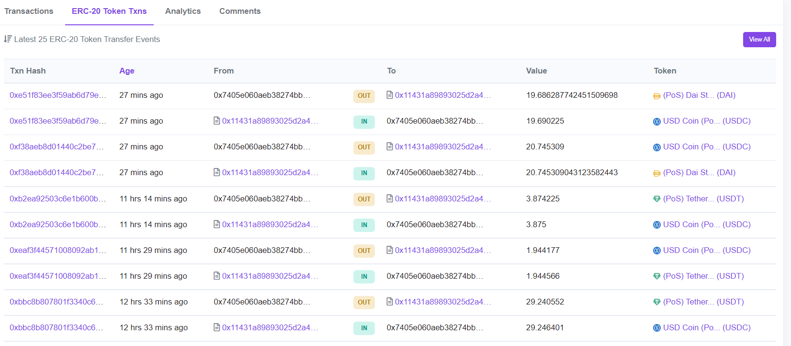

# Gitcoin Hackathon 11: 1Inch StableCoin Market Making

This repo contains code for market making stable coins using the 1Inch limit order protocol. 

Addresses this gitcoin [bounty](https://gitcoin.co/issue/1inch/limit-order-protocol/39/100026633).

## Description

The script will market make each pair of USDC, DAI and USDT and take a simple assumption that each of these stables is worth the same. It is then always good  to swap one for more units of the other. Based on a basis points setting the script places all the possible order combinations offering to swap one for slightly more of the the other. For example with order size of 200 and basis point 2 we will swap 200 or token A for 200.04 fo token b (securing 4 cent profit with each swap!).

Note the following implementation details:

- All orders are placed with a 10 minute "time out" using the predicate feature. This means there is no need to cancel orders (which would cost gas). Generally this makes for easier testing and iteration as old orders always time out.
- Over time the orders get filled so the script loops and adds new orders when the old orders remaining quantity gets low.

### Results

Ran this for a day and it does work well. I set the swap rate at 2 basis points and odder size at 200. At those settings I am seeing a few hits per hour (partial executions).

Following is sample output. Shows the current coin balance in the account and the limit orders that are outstanding.

```
TotalBal:533.34, Token:USDC Balance:502.04, Token:DAI Balance:0.05, Token:USDT Balance:31.25
From: USDC To: DAI remaining: 200.0 at create time:2021-09-25T12:41:23.581Z
From: USDC To: USDT remaining: 200.0 at create time:2021-09-25T12:41:23.308Z
From: DAI To: USDC remaining: 200.0 at create time:2021-09-25T12:36:17.639Z
From: USDT To: USDC remaining: 200.0 at create time:2021-09-25T12:33:13.813Z
From: USDT To: DAI remaining: 200.0 at create time:2021-09-25T12:33:12.972Z
From: DAI To: USDT remaining: 200.0 at create time:2021-09-25T12:32:10.732Z
```

Following screen shot from polygonscan shows the swaps happening.


## How to run

- Clone this repository
- Install Dependencies ```npm install```
- [Setup the env file](#env-file-setup)

Review the code and ensure you understand what it is doing.

To run: ```node main.js```
### Comments on using the 1Inch API

Some points about using the API

- I installed via npm. Had to edit the package.json file from src/index.js to index.js. Might be an issue with my environment.
- Order predicate is listed as an optional field but orders submitted with no predicate were rejected. In any case I used predicate filed to time out my orders so this was not an issue in actual usage.
### .env file setup

Rename `.env.sample` to `.env` and review/set the parameters:

Note that MAX_GAS and GAS_LIMIT are not used.

```
RPC=https://polygon-rpc.com/
PRIVATE_KEY=<add you private key here>
ADDR=<add your address here>

MAX_GAS=31
GAS_LIMIT=1000000

TRADE_SIZE=200
SPREADBP = 2

LOOP_TIME_MS=60000
NUM_OF_LOOPS=100000
```
## Resources

[Limit Order Protocol Documentation](https://docs.1inch.io/limit-order-protocol/)

- Use it right in [1inch dApp](https://app.1inch.io/#/1/classic/limit-order/WETH/DAI)
- Smart Contracts [repository](https://github.com/1inch/limit-order-protocol/)
- Utils library [repository](https://github.com/1inch/limit-order-protocol-utils/)
- REST API ([Ethereum](https://limit-orders.1inch.exchange/swagger/ethereum/), [BSC](https://limit-orders.1inch.exchange/swagger/binance/), [Polygon](https://limit-orders.1inch.exchange/swagger/polygon/))
