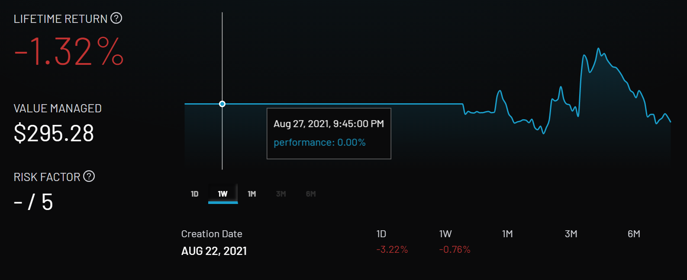

# Strategy 2 - Eth Trend Chasing

This is a strategy designed to trade actively using a simple price signal. 

- The pool allows deposits of USDC and ETH
- Every interval the strategy checks the USDC - ETH price. 
- If ETH price went up by a configured amount (in basis points) then swap USDC for ETH (trending up ... buy  ETH)
- If ETH price went down by a configured amount (in basis points) then swap ETH for USDC (tending down ... sell ETH)

## Results

You can see the results [here](https://app.dhedge.org/pool/0x4ccd4510d7ae04dcc36e4bb541ebce5dc5023c34) for this strategy with small size. Even after a day or two there seems to be a clear down trend.

