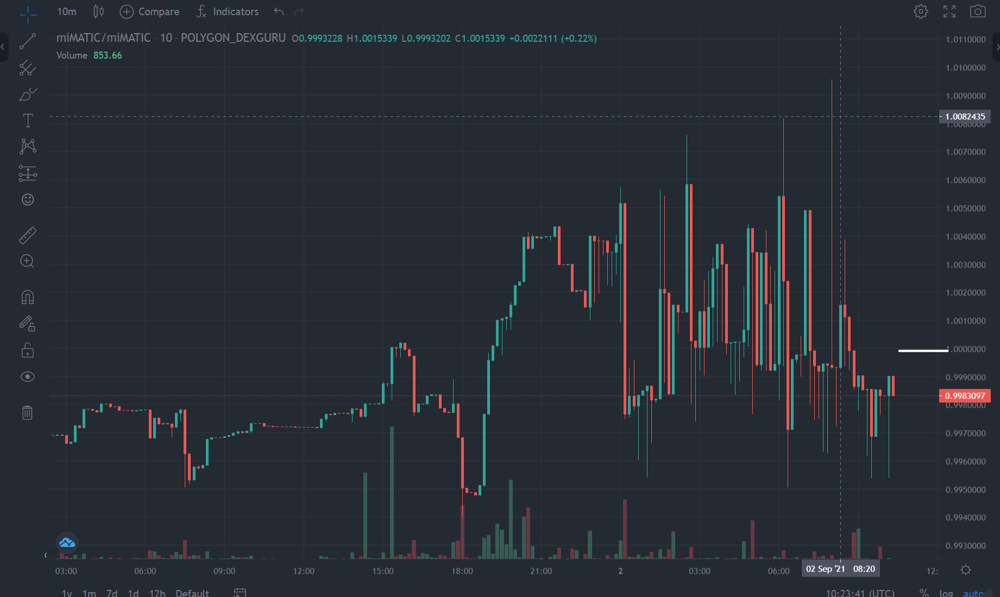

# Strategy 1 - Stable Coin Re-balancing

In the polygon ecosystem there are multiple stable coins that track closely to the dollar. Due to supply and demand the price of these coins sometimes moves away from one dollar. A good example is the polygon native MAI stable coin (see [here](https://app.mai.finance/)) which trades between 0.99 and 1.01 due to its stabilization mechanism. See the screen shot below.

So the strategy allows the user to deposit any of the available stable coins. It then monitors the swap prices of each of the stable coins and looks for any swap that will result in increasing the quantity of amount of coins.

For example if we start with 100 USDC and see opportunity to swap for 100.1 USDT we simply do the swap. Over time we aim to increase the amount.

## Challenges

There are two challenges that really prevent this strategy for working in the current dHedge system.

1. For trading we only have access to SushiSwap pools so we will see some slippage while trading. In simple terms we have to pay the 0.3% liquidity fee which is critical for this price sensitive active strategy. Providing more liquidity pools and access to a liquidity aggregator (e.g. 1Inch, 0x, ParaSwap) is likely needed for this kind of active strategy.
2. Currently only USDC, USDT and DAI are available. Availability of more volatile stables (e.g. MAI, BUSD, RUSD, UST) could make this a viable strategy. 

